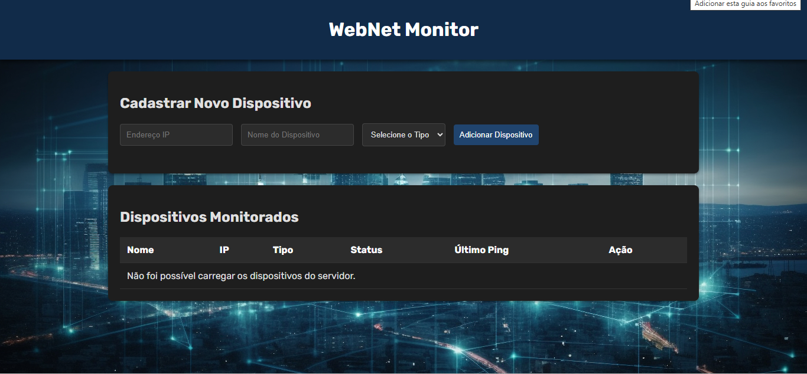

# WebNet_Monitor

Monitoramento simples e offline de dispositivos de rede local (computadores, impressoras, roteadores, câmeras etc.) usando apenas **HTML, CSS e JavaScript puro**.
Nenhum servidor, nenhum Node.js, nenhum banco de dados externo — tudo roda direto no navegador e os dados ficam salvos no **localStorage** do seu computador.
Ideal para laboratórios de informática, pequenas redes ou uso em sala de aula.

## Funcionalidades
- Cadastro de dispositivos (nome, IP, tipo e localização)
- Teste de conectividade via **ping** diretamente no navegador
- Status em tempo real (online/offline com tempo de resposta)
- Histórico completo de testes por dispositivo
- Interface 100% responsiva (funciona no celular e no PC)
- Persistência total dos dados usando **localStorage**
- Tudo offline – abre o `index.html` e já funciona!

## Capturas de Tela

*(Depois que tirar as prints, coloca na pasta `/screenshots` e deixa esses links)*

## Como usar
1. Clone ou baixe o repositório
2. Abra o arquivo `index.html` no navegador (Chrome, Firefox, Edge...)
3. Cadastre seus dispositivos
4. Clique em "Testar Todos" ou no ícone de play do dispositivo
5. Pronto! O monitoramento já está rodando

**Não precisa instalar nada!**

## Tecnologias utilizadas
- HTML5
- CSS3 (com Flexbox e Grid)
- JavaScript puro (Vanilla JS)
- Node JS
- localStorage para persistência
